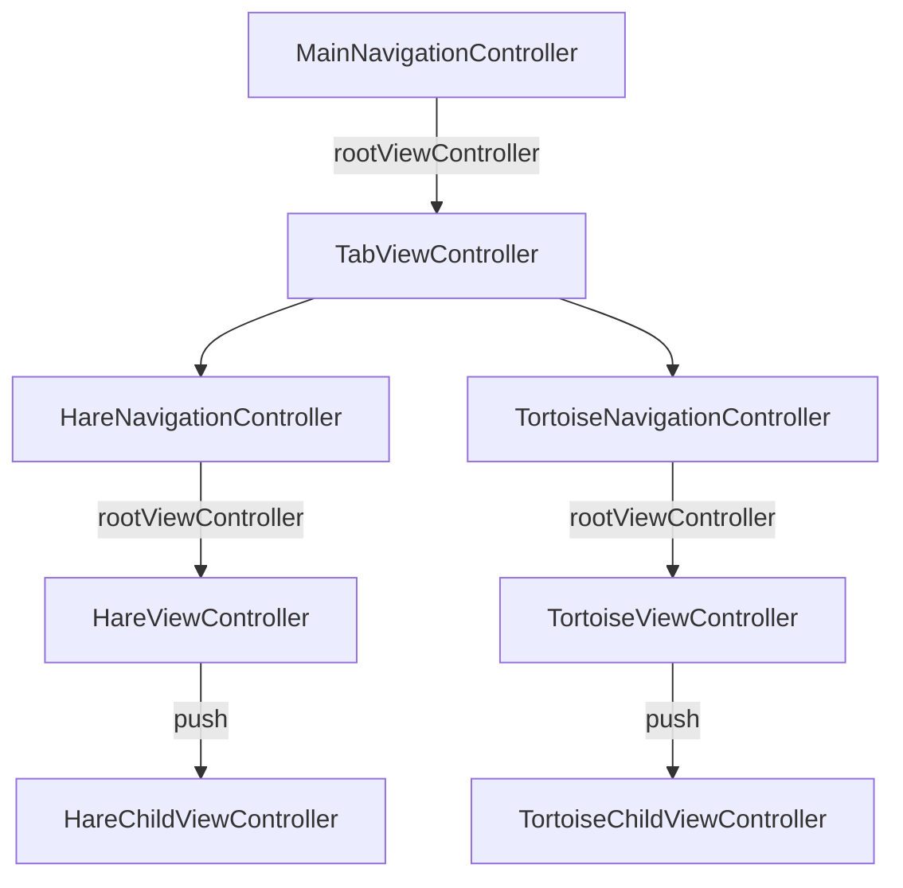

# TestNavigation
This project demostrates the issue on iPadOS 18, where it hides the back button and shows the previous view controller's menu button.

The project has the following architecture:

## The Issue:
The bar button item kept in the main screen is retained on the next pushed view controller. The default back item is shown when you rotate the screen.

